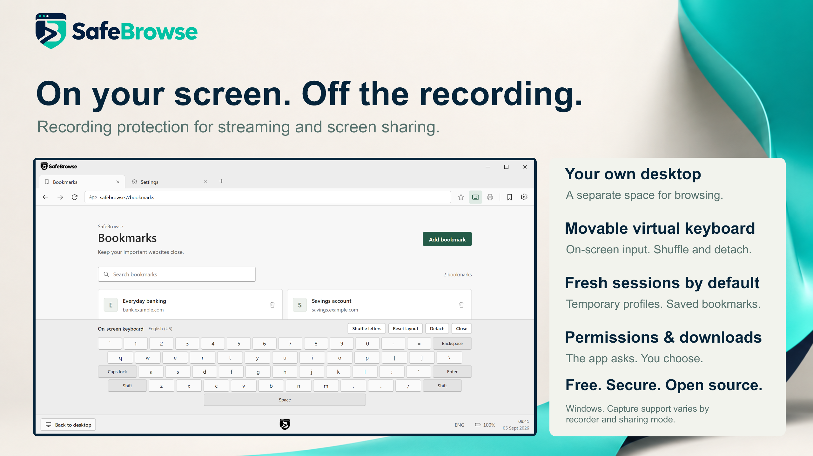

<div align="center">

# SafeBrowse

### A separate browser for the moments you do not want to share.

Free and open source for Windows. Made for streamers, screen sharing and live demos.

[](https://github.com/itsdanielyc/SafeBrowse/releases/download/v0.1.0/SafeBrowse-Setup-0.1.0-x64.exe)
[](LICENSE)
[](https://github.com/itsdanielyc/SafeBrowse/stargazers)

[Get started](#get-started) · [Watch the demo](#see-it-in-action) · [Security](SECURITY.md) · [Contribute](CONTRIBUTING.md)

</div>



Sharing your screen should not mean sharing every browser task. SafeBrowse gives you a separate browsing desktop and asks Windows to exclude its windows from supported screen capture. Open a separate session, do your browsing, then return to your usual desktop.

**Public preview.** The maintainer has tested capture exclusion with OBS and Windows screen recording. Capture behavior depends on the recorder, capture mode and Windows configuration; test your actual sharing setup with dummy content before using it live. SafeBrowse does not redact other applications or guarantee protection from every recording method. See the [security boundaries](SECURITY.md).

## See it in action

https://github.com/user-attachments/assets/4c57fe7e-4366-4f2d-b8c5-004962f5f6bf

[Download the original demo · 1440p MP4](docs/media/safebrowse-demo.mp4)

The demo shows the product interface. For capture-test scope and remaining platform checks, see [validation notes](docs/VALIDATION.md).

## Get started

1. **[Download SafeBrowse for Windows x64](https://github.com/itsdanielyc/SafeBrowse/releases/download/v0.1.0/SafeBrowse-Setup-0.1.0-x64.exe)** or visit the [release page](https://github.com/itsdanielyc/SafeBrowse/releases/tag/v0.1.0).
2. Run the installer normally, without **Run as administrator**. It installs for your Windows account and offers an optional desktop shortcut.
3. Open **SafeBrowse** from the Start menu. Browse in its separate desktop.
4. Choose the **Back to desktop** button to return. Click SafeBrowse's taskbar entry to go back to the session. Close the browser to end it.

**Requirements:** Windows x64, Windows 11 or Windows 10 build 19041 or later, and a supported Microsoft Edge WebView2 Evergreen Runtime. Use a Windows version still receiving security updates. The installer checks WebView2 and can install a missing or older runtime using Microsoft's bootstrapper. This requires internet only when the runtime needs installing or updating.

**This preview is unsigned.** Windows may show an unrecognised-app warning, and managed computers may block it. Download only from this repository's releases. Release checksums help check the downloaded file; they are not a publisher signature.

SafeBrowse clears the **current Windows clipboard** when entering and normally leaving an isolated session. Clipboard history and cloud synchronisation are separate Windows features and are not cleared by this operation.

## What you get

| Feature | How it works |
| --- | --- |
| Separate browsing desktop | Return with the **Back to desktop** button; use SafeBrowse's taskbar entry to go back to the session. |
| Capture exclusion by default | Windows capture protection is applied and checked before the browser appears. If it cannot be applied, the session fails to start. |
| Fresh browsing sessions | Temporary cookies and site data are removed on normal close; an optional persistent mode keeps them. Bookmarks and preferences remain between sessions. |
| Familiar browser controls | Tabs, back and forward, bookmarks, an address/search bar and an on-screen keyboard. |
| Clear website choices | Prompts for supported permissions and popups, with saved per-site rules. |
| Downloads you control | Confirmation by default, with Disabled and Always allowed options. Files are never opened automatically. |
| Optional printing | SafeBrowse's Print button and **Ctrl+P** are disabled until enabled in Settings. |
| Maintained browser engine | Uses Microsoft's installed WebView2 Evergreen Runtime, with a restart notice when an installed runtime update is announced. |

Read the [usage guide](docs/USAGE.md) for keyboard behavior, command-line options, permissions and storage details.

## What to expect when sharing

SafeBrowse is designed to reduce accidental exposure of **its own browser windows** through supported Windows capture APIs. It does not blur your regular browser, hide notifications from other apps, or inspect what you type to decide whether it is sensitive.

Normal sessions switch the active desktop across **all connected monitors**. Your usual streaming controls or meeting window will not stay visible on a second display while you are in that session; use the desktop button or shortcut to return to them.

Before a stream, call or demonstration, check the **recorded or recipient view** using a test page. OBS modes, meeting applications and remote-access tools do not all capture the screen in the same way. Google Meet compatibility has not yet been documented. Native printer, driver and save dialogs also do not have verified capture protection; avoid opening them while sharing sensitive content.

The recording override is reserved for development: `--allow-screen-recording` deliberately turns capture protection off for that launch and displays a red warning. It is never saved as a preference.

### Security scope

SafeBrowse has not undergone an independent security audit. A separate desktop is not a virtual machine or a separate Windows account, and the app does not establish protection against malware already running on your computer. The on-screen keyboard is not a proven keylogger defence. Temporary-file deletion is not secure erasure, and crashes or locked files can leave data behind.

This project was inspired by Bitdefender Safepay's dedicated browsing experience. It is independent, unaffiliated with Bitdefender, and does not claim equivalent security. It includes no VPN or password manager and provides no project-owned malicious-site detection service; WebView2's own reputation setting is required, subject to Windows policy.

Use test accounts while evaluating this preview. The [security policy](SECURITY.md) and [validation notes](docs/VALIDATION.md) explain what is implemented, what has been exercised and what remains unverified.

## Updates and removal

WebView2 receives updates through Microsoft's Evergreen servicing. When SafeBrowse shows **Restart to update**, finish your current task, close the application and reopen it. SafeBrowse itself has no automatic updater yet; get newer application versions from [Releases](https://github.com/itsdanielyc/SafeBrowse/releases), or use GitHub's **Watch → Custom → Releases** notification option.

To uninstall, open **Windows Settings → Apps → Installed apps → SafeBrowse → Uninstall**. The uninstaller offers to remove settings and browsing data. **No** keeps bookmarks, preferences, saved permissions and the optional persistent profile; **Yes** removes those known files. Both choices clean verified inactive temporary profiles. Downloads and the shared WebView2 Runtime are kept. Unknown files, printed output, Windows records and backups are outside automatic removal. See [installation and removal details](docs/INSTALLER.md).

## Build and contribute

Bug reports, accessibility improvements, documentation and carefully scoped fixes are welcome. Capture and multiple-monitor reports are especially useful when they include the exact environment and disposable test content.

Install the Rust MSVC toolchain pinned in [rust-toolchain.toml](rust-toolchain.toml), Microsoft C++ Build Tools with the Windows SDK, and the supported WebView2 Evergreen Runtime. Then, on Windows:

```powershell
git clone https://github.com/itsdanielyc/SafeBrowse.git
cd SafeBrowse
cargo build --release --locked
.\target\release\safebrowse.exe
```

Read [CONTRIBUTING.md](CONTRIBUTING.md) for verification commands and reporting guidance. See [release tooling](docs/RELEASING.md) and [installer packaging](docs/INSTALLER.md) to build distributable files.

**Found a security issue?** Please [report it privately](https://github.com/itsdanielyc/SafeBrowse/security/advisories/new), following [SECURITY.md](SECURITY.md). Keep credentials, personal browsing data and exploit details out of public issues.

## Support the project

If SafeBrowse is useful to you, **give the repository a star**. It helps other people discover the project and lets us see interest grow from this first release.

[](https://github.com/itsdanielyc/SafeBrowse/tree/star-history)

The graph records the repository's star count once per day from publication. A new repository has little history; the chart fills in as daily observations arrive.

## License and acknowledgements

SafeBrowse is available under the [MIT License](LICENSE). Dependencies retain their respective licences. Built with Rust, [Tao](https://github.com/tauri-apps/tao), [Wry](https://github.com/tauri-apps/wry) and [Microsoft Edge WebView2](https://developer.microsoft.com/en-us/microsoft-edge/webview2/). The Windows installer uses [Inno Setup](https://jrsoftware.org/isinfo.php).

## Troubleshooting

<details>
<summary><strong>Windows warns that the installer is unrecognised</strong></summary>

The current preview is unsigned. Confirm that the download came from this repository's [Releases](https://github.com/itsdanielyc/SafeBrowse/releases) page and check its published checksum if needed. On a managed PC, contact your administrator; do not disable security controls to bypass a block.

</details>

<details>
<summary><strong>Setup needs internet or WebView2 is missing/outdated</strong></summary>

The small installer includes Microsoft's bootstrapper, not the complete browser runtime. It can work offline when a suitable WebView2 Runtime is already present. If it needs to install or update the runtime, connect to the internet and retry.

For an offline computer, separately obtain Microsoft's [Evergreen Standalone Installer](https://developer.microsoft.com/microsoft-edge/webview2/#download-section) for x64, install it, then run SafeBrowse's installer. The current technical support floor is WebView2 `151.0.4129.107`; this is a compatibility baseline, not proof that a runtime is fully patched. Keep Evergreen updates enabled. The runtime is separate from the Microsoft Edge browser.

If the error names a WebView2 environment override or policy, remove the launch override or ask the computer's administrator to review it. SafeBrowse does not change those settings automatically. See [startup troubleshooting](docs/USAGE.md#startup-troubleshooting).

</details>

<details>
<summary><strong>SafeBrowse says it cannot run as administrator</strong></summary>

Close the elevated terminal and open SafeBrowse normally. Check that its shortcut is not configured to **Run as administrator**. SafeBrowse and its installer intentionally refuse elevated launches.

If ordinary applications also launch elevated because UAC is disabled, use a standard account or restore UAC and restart Windows. Managed computers should be reviewed by their administrator. Detailed repair guidance is in the [usage guide](docs/USAGE.md#startup-troubleshooting).

</details>

<details>
<summary><strong>How do I get back to Windows or return to SafeBrowse?</strong></summary>

Use the **Back to desktop** button. On your usual desktop, click the existing SafeBrowse taskbar entry to return to the browsing session; starting another copy does not open a second session.

If the session becomes unresponsive, Windows' **Ctrl+Alt+Delete** screen remains an escape route. Unsaved input can be lost. After an abnormal exit, check any transaction's status before repeating it: SafeBrowse does not automatically replay submissions.

</details>

<details>
<summary><strong>Will SafeBrowse work with more than one monitor?</strong></summary>

SafeBrowse creates one browser window. Windows chooses its initial placement, and the browser uses the monitor containing the window for its layout. It does not promise to open on whichever monitor held the shortcut you clicked.

In normal isolated mode, switching desktops changes the active desktop across **all monitors**; it does not keep your ordinary desktop visible on the other display. This matters for streaming controls and meeting windows. Multi-monitor and display-change behavior still needs broader hardware testing; see [validation notes](docs/VALIDATION.md). Check your exact monitor layout, scaling and capture sources with dummy content before going live.

</details>

<details>
<summary><strong>SafeBrowse appears in my recording, or capture protection cannot be applied</strong></summary>

Check that the shortcut does not include `--allow-screen-recording`. A red recording warning and indicator mean capture protection is deliberately disabled for that launch. Close the session and relaunch without the flag.

With protection enabled, capture results still depend on the API and mode used by the recorder. The app refuses to show its browsing window if Windows cannot apply its capture setting. Use disposable content when investigating. Report a suspected protection bypass [privately](https://github.com/itsdanielyc/SafeBrowse/security/advisories/new), including the recorder version, exact capture source/mode, Windows build and launch options.

</details>

<details>
<summary><strong>A page, sign-in, download or print workflow does not work</strong></summary>

Check Settings first: downloads ask by default, popups have their own policy, and SafeBrowse's printing controls default to off. Allowed popups open as tabs. Direct file access, some cross-origin frame permissions and external-application sign-in flows are unsupported.

Do not disable certificate checks, the browser sandbox or site isolation to work around a site. Use a minimal reproduction with test data when [reporting a compatibility issue](https://github.com/itsdanielyc/SafeBrowse/issues/new/choose). Printing details and known limitations are in the [usage guide](docs/USAGE.md#printing).

</details>

<details>
<summary><strong>Temporary data could not be removed, or uninstall stopped</strong></summary>

Close all SafeBrowse sessions and retry. Cleanup may be blocked by a browser process or a locked file. SafeBrowse retries marked abandoned-profile cleanup on a later launch; a cleanup error can prevent a new session. If uninstall cleanup fails, the installed application and helper remain available for a retry, although some selected data may already have been removed.

Keep the reported error and path, but redact your Windows username before sharing them. Avoid deleting broad AppData or Temp folders. See [storage locations and cleanup boundaries](docs/USAGE.md#storage-and-privacy) and [removal behavior](docs/INSTALLER.md#removal-design).

</details>

<details>
<summary><strong>I need the exact error wording or want to report another problem</strong></summary>

The [error-message catalogue](docs/reviews/error-message-catalogue-2026-09-04.md) records an earlier source snapshot of application messages and their triggers. Windows, WebView2 and websites may supply additional wording. Include your SafeBrowse version, Windows build, WebView2 version, launch options, expected result and steps to reproduce with dummy data in a [bug report](https://github.com/itsdanielyc/SafeBrowse/issues/new/choose).

Never include passwords, tokens, real financial information or recordings of sensitive content. For security concerns, use [private reporting](https://github.com/itsdanielyc/SafeBrowse/security/advisories/new).

</details>
